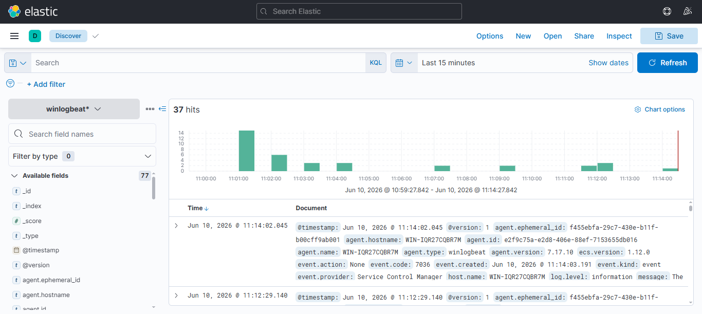
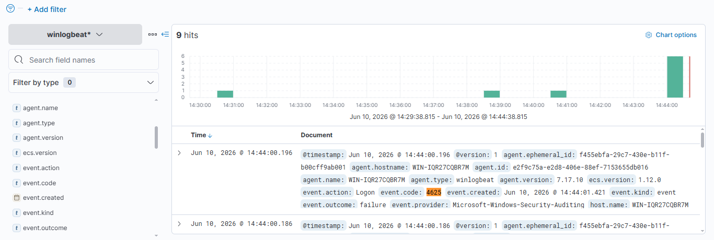
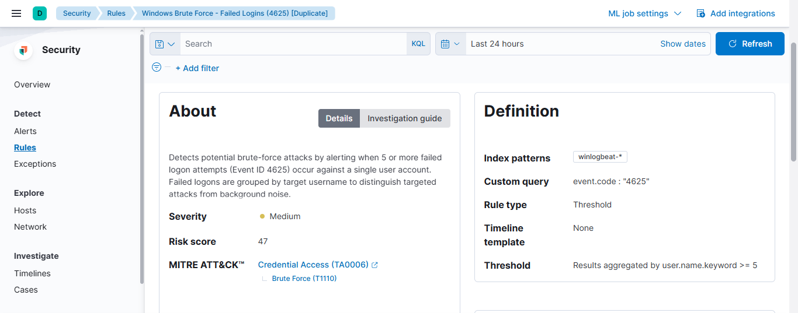
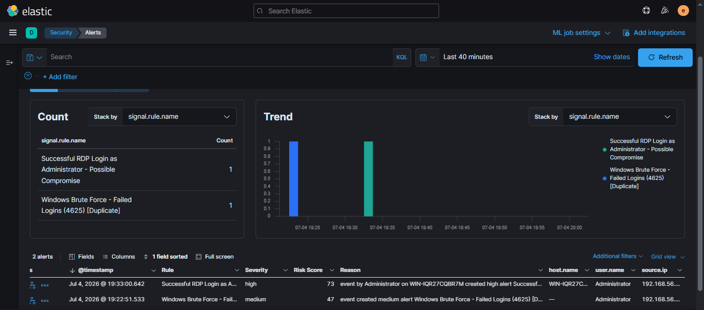

# ELK Stack Lab — Windows Threat Detection

An ELK Stack (Elasticsearch, Logstash, Kibana) deployment for SOC detection
engineering. This lab collects Windows Event Logs, normalizes them to ECS, and
runs two Kibana Security detection rules — a brute-force detection and a
post-compromise RDP detection — both mapped to MITRE ATT&CK and validated
against simulated attacks.

---

## Environment

| Component | Details |
|-----------|---------|
| SIEM | ELK Stack (Elasticsearch 7.17.10, Logstash, Kibana) in Docker |
| Log source | Windows Server 2019 VM (VirtualBox) |
| Log shipper | Winlogbeat |
| Attacker | Kali Linux VM (`192.168.56.102`) |
| Network | VirtualBox Host-Only (`192.168.56.0/24`) |

---

## Pipeline

```
Windows Server 2019  →  Winlogbeat  →  Logstash  →  Elasticsearch  →  Kibana
   (Security logs)      (log shipping)  (ECS norm.)   (winlogbeat-*)   (detection)
```

Windows Security Event Logs are shipped by Winlogbeat, processed through Logstash
for ECS (Elastic Common Schema) field normalization, and stored in the
`winlogbeat-*` index for detection and analysis in Kibana.



*Winlogbeat events in Kibana Discover, with ECS fields (`agent.*`, `event.*`,
`host.*`) populated.*

---

## Detection 1: Brute-Force / Failed Logon (Event ID 4625)

A **threshold** rule that triggers when 5 or more failed logon events occur
against a single user account, distinguishing targeted attacks from background
noise.

| Setting | Value |
|---------|-------|
| Rule type | Threshold |
| Index pattern | `winlogbeat-*` |
| Query | `event.code : "4625"` |
| Threshold | Grouped by `user.name.keyword`, count `>= 5` |
| Severity | Medium (Risk score 47) |
| MITRE ATT&CK | [T1110 Brute Force](https://attack.mitre.org/techniques/T1110/) — Credential Access (TA0006) |



*4625 events filtered, showing `event.outcome: failure` (ECS-normalized).*



*The Kibana threshold detection rule with MITRE ATT&CK mapping (T1110 Brute Force,
Credential Access).*

---

## Detection 2: Successful RDP Login as Administrator (Possible Compromise)

A behavioral detection that goes beyond failed-attempt counting: it flags a
**successful** interactive/RDP logon by a privileged account. In a brute-force
scenario, a successful admin login immediately following failed attempts is a
strong indicator of compromise.

| Setting | Value |
|---------|-------|
| Focus | Successful RDP logon (`Logon_Type 10`) as Administrator |
| Severity | High (Risk score 73) |
| Rationale | Post-authentication activity — catches the attack *succeeding*, not just being attempted |

This pairs with Detection 1 to tell a complete story: the brute-force rule catches
the attempt, and this rule catches the breach if the attempt succeeds.



*Kibana Alerts page showing both rules firing, with `source.ip` attribution and
risk scores.*

---

## Validation

Attacks were launched from the Kali VM against the Windows victim:

- **Brute-force:** repeated failed logons generated 4625 events, tripping the
  threshold rule.
- **RDP compromise:** a successful RDP session (via FreeRDP) as Administrator from
  `192.168.56.102` triggered the high-severity possible-compromise rule.

Both alerts appear on the Kibana Alerts dashboard with source IP, target account,
and risk score.

---

## Key Takeaways

- Deployed a full ELK pipeline with Winlogbeat → Logstash → Elasticsearch → Kibana
- Applied ECS field normalization for consistent, queryable data
- Built two complementary detections: threshold-based (attempt) and behavioral
  (successful compromise)
- Mapped detections to MITRE ATT&CK (T1110, Credential Access)
- Validated both detections with real adversary simulation from Kali
