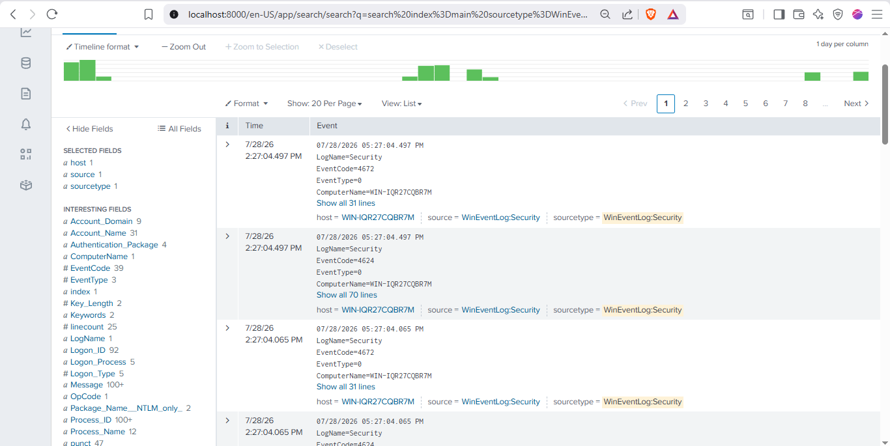
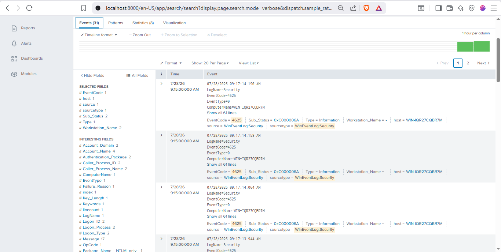
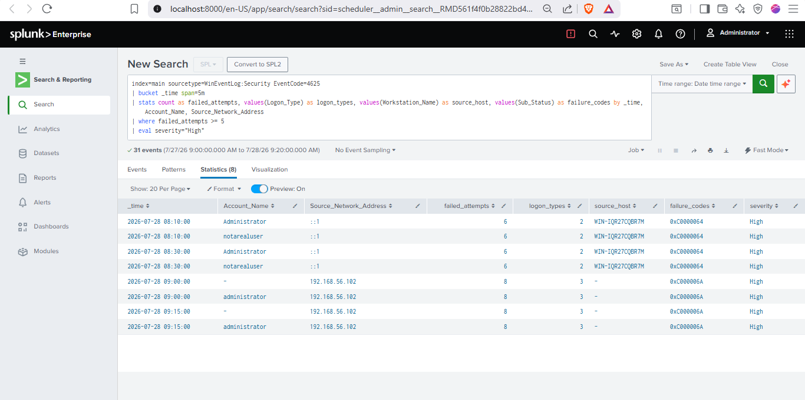
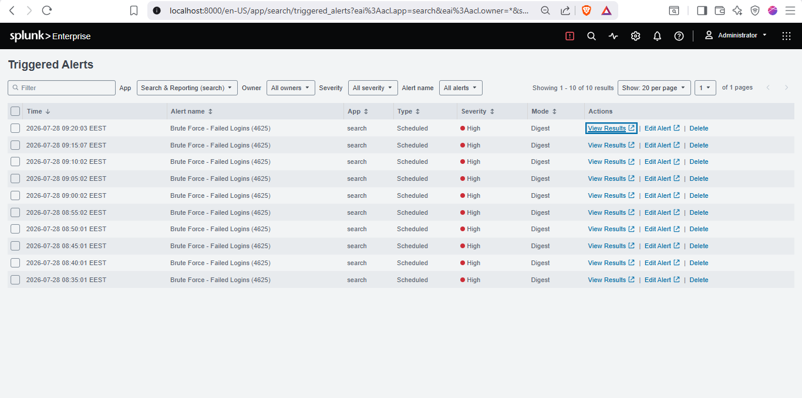
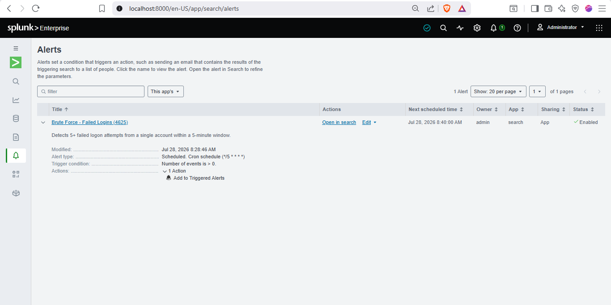

# Splunk Lab — Brute-Force Detection

A Splunk Enterprise deployment for SOC detection engineering, covering log
ingestion from a Windows endpoint, detection rule development in SPL, and
scheduled alerting validated against simulated attacks.

---

## Environment

| Component | Details |
|-----------|---------|
| SIEM | Splunk Enterprise (Docker container on host) |
| Log source | Windows Server 2019 VM (VirtualBox) |
| Log shipper | Splunk Universal Forwarder |
| Attacker | Kali Linux VM (`192.168.56.102`) |
| Network | VirtualBox Host-Only (`192.168.56.0/24`) |
| Receiving port | `9997` (forwarder → indexer) |

---

## Pipeline

```
Windows Server 2019  →  Universal Forwarder  →  Splunk Indexer (9997)  →  Search & Alerting
   (Security logs)         (log shipping)          (index=main)
```

Windows Security Event Logs (Application, System, Security) are collected by the
Universal Forwarder and sent to the Splunk indexer over the host-only network.
Receiving was enabled on port `9997`, and event log inputs were configured in
`inputs.conf`:

```ini
[WinEventLog://Security]
disabled = 0
index = main
```



*Windows Security events ingesting into Splunk, with fields auto-extracted
(EventCode, Account_Name, Logon_Type).*

---

## Detection: Brute-Force / Failed Logon (Event ID 4625)

The detection counts failed logon events per account within a rolling 5-minute
window and triggers when the count reaches the threshold — the signature of a
brute-force attempt.

```spl
index=main sourcetype=WinEventLog:Security EventCode=4625
| bucket _time span=5m
| stats count as failed_attempts,
        values(Logon_Type) as logon_types,
        values(Workstation_Name) as source_host,
        values(Sub_Status) as failure_codes
        by _time, Account_Name, Source_Network_Address
| where failed_attempts >= 5
| eval severity="High"
```

**MITRE ATT&CK:** [T1110 — Brute Force](https://attack.mitre.org/techniques/T1110/)
(Tactic: Credential Access, TA0006)

### Enrichment

Each alert carries the context an analyst needs to triage without pivoting:

| Field | Meaning |
|-------|---------|
| `Source_Network_Address` | Attacker IP address |
| `Logon_Type` | 2 = local/interactive, 3 = network, 10 = RDP |
| `Sub_Status` | Failure reason (see below) |

`Sub_Status` distinguishes the *type* of attack:

- `0xC0000064` — account does not exist → **user enumeration**
- `0xC000006A` — account exists, wrong password → **password guessing**



*Raw 4625 events showing the `Sub_Status` and `Workstation_Name` fields the
detection relies on.*

---

## Validation

The detection was tested against real attacks from the Kali VM:

| Attack | Method | Result |
|--------|--------|--------|
| Local | `runas` with wrong passwords | `Logon_Type 2`, source `::1`, `Sub_Status 0xC0000064` |
| Network (SMB) | `nxc smb` brute-force vs port 445 | `Logon_Type 3`, source `192.168.56.102`, `Sub_Status 0xC000006A` |

The results below show both vectors captured and distinguished by logon type and
failure code — a single detection covering local and network attacks with full
attribution.



*Enriched results showing the attacker IP (`192.168.56.102`), logon types, and
failure codes.*

---

## Alerting

The search was saved as a **scheduled alert** running every 5 minutes
(cron `*/5 * * * *`), triggering when results exist, with severity High and the
"Add to Triggered Alerts" action.



*Alerts firing on schedule during the attack window.*



*Saved alert configuration — enabled, scheduled, High severity.*

---

## Key Takeaways

- Stood up a working Splunk pipeline from endpoint to alert, in Docker
- Wrote and tuned an SPL detection with actionable enrichment, not just a count
- Distinguished attack types (enumeration vs guessing) via failure-code analysis
- Validated the detection end-to-end with real adversary simulation
- Mapped the detection to MITRE ATT&CK for SOC-standard documentation
